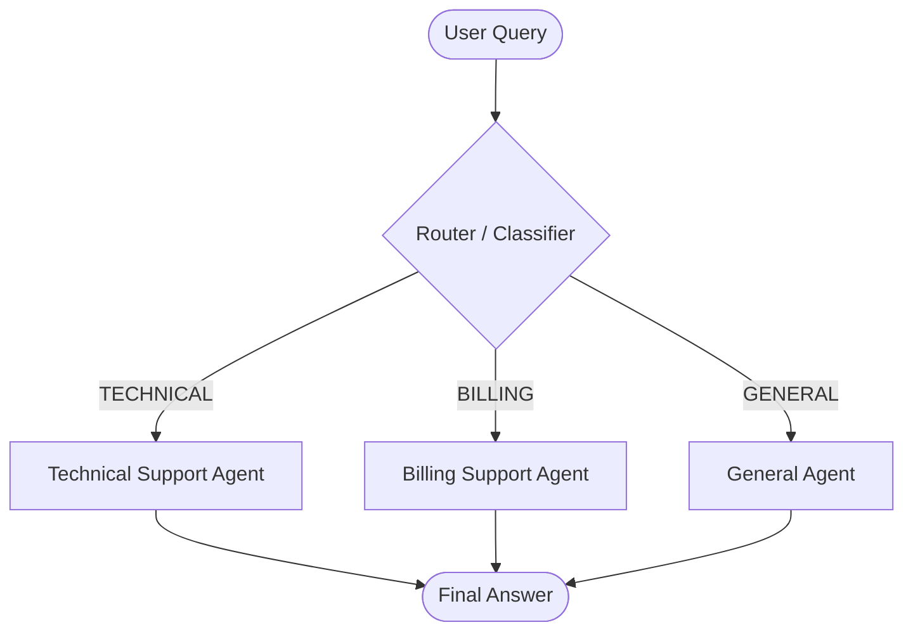

# Level 3.1: Routing & Classification (Intent Detection) 🤖➡️🎯

In this lesson, we enter **Level 3: Systems (Multi-Agent)**. We transition from single-agent workflows (like ReAct) to architectures where multiple agents collaborate. The simplest and most foundational pattern in multi-agent systems is **Routing & Classification**.

## What is Routing & Classification?

Routing is the process of using an LLM to inspect an incoming query, classify the user's intent, and direct the query to a specialized handler or downstream agent.

Instead of having a single monolithic prompt that tries to handle all possible queries (which makes the prompt fragile and leads to instructions conflicting with each other), we use a small, fast router model to classify the intent first, then hand off the query to a specialized agent designed *specifically* for that category.



## Why use Routing & Classification?

1.  **Separation of Concerns**: Each specialized agent has its own system prompt, tools, and context, making them much easier to maintain and refine.
2.  **Accuracy and Reliability**: By narrowing the focus of the downstream agent, you minimize context distraction and prompt confusion, drastically reducing hallucinations.
3.  **Cost and Latency Efficiency**: You can use a smaller, faster model (e.g., Llama 3.2 1B or 3B) for the routing stage to keep latency low, and route only complex requests to larger, more expensive models or pipelines.
4.  **Specialized Tools**: Downstream agents can be equipped only with the tools they actually need. For example, the Billing Agent has database access to invoices, whereas the Technical Agent has search and execution tools.

## Core Concepts in this Lesson

1.  **Structured Intent Classification**: Using JSON mode (`response_format={"type": "json_object"}`) and Pydantic validation to guarantee the router returns a valid enum classification (`TECHNICAL`, `BILLING`, or `GENERAL`) along with a confidence score.
2.  **Dynamic Agent Selection (Handoff)**: Mapping the classification result to separate agent runner functions, each with unique system prompt guidelines.
3.  **Context Sharing**: Feeding the original query (and potentially metadata) to the selected specialist agent to generate the final response.

## How to Run

1.  Make sure Ollama is running locally with the `llama3.2` model.
2.  Run the script:
    ```bash
    python routing.py
    ```
